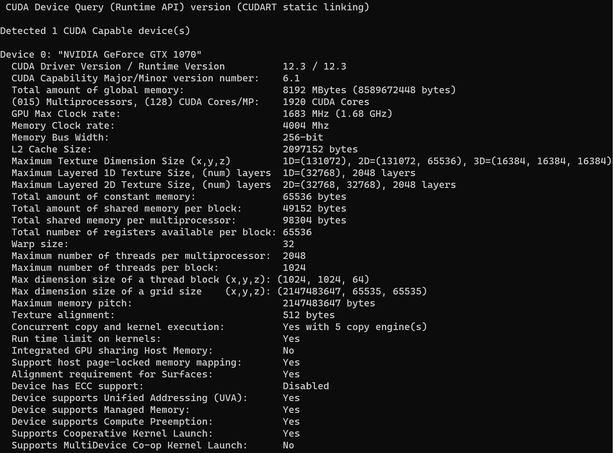
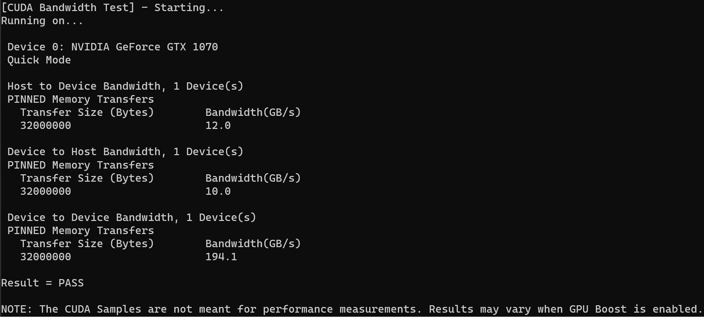
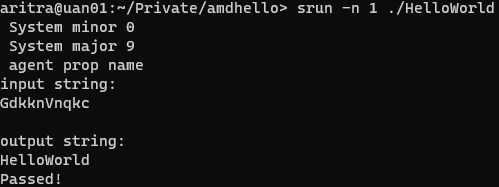

%Assignment II: CUDA Basics I
%Aritra Bhakat
%\today
---
documentclass: scrartcl
---

## Exercise 1: Reflection on GPU-accelerated Computing
**1. List the main differences between GPUs and CPUs in terms of architecture.**

CPUs are built with a latency-oriented architecture. It completes a single serial task very quickly. GPUs are built with a throughput-oriented architecture. While they cannot complete a single task as fast as a CPU, they can complete many small tasks in parallel much quicker than a CPU (ie. higher throughput).

**2. Check the latest Top500 list that ranks the top 500 most powerful supercomputers in the world. In the top 10, how many supercomputers use GPUs? Report the name of the supercomputers and their GPU vendor (Nvidia, AMD, ...) and model.**

In the June 2023 Top500 list, 7 out of the top 10 supercomputers use GPUs. Supercomputers Frontier and LUMI use AMD Instinct MI250X GPUs. Leonardo,  Perlmutter and Selene use NVIDIA A100 GPUs, while Summit and Sierra use NVIDIA Volta GV100. Tianhe-2A uses a multi-core accelerator called Matrix-2000, but I did not count it as it is not really a GPU.

**3. One main advantage of GPU is its power efficiency, which can be quantified by Performance/Power, e.g., throughput as in FLOPS per watt power consumption. Calculate the power efficiency for the top 10 supercomputers.**

| Rank | System               | Efficiency (GFlops/W) |
|------|----------------------|-----------------------|
| 1    |             Frontier |                 52.59 |
| 2    | Supercomputer Fugaku |                 14.78 |
| 3    |                 LUMI |                 51.38 |
| 4    |             Leonardo |                 32.24 |
| 5    |               Summit |                 14.72 |
| 6    |               Sierra |                 12.72 |
| 7    |    Sunway TaihuLight |                  6.05 |
| 8    |           Perlmutter |                 27.37 |
| 9    |               Selene |                 23.98 |
| 1o   |            Tianhe-2A |                  3.32 |


## Exercise 2: Query Nvidia GPU Compute Capability

**1. The screenshot of the output from running deviceQuery test in /1_Utilities.**



**2. What is the Compute Capability of your GPU device?**

`CUDA Capability Major/Minor version number:    6.1`

**3. The screenshot of the output from running bandwidthTest test in /1_Utilities.**



**4. How will you calculate the GPU memory bandwidth (in GB/s) using the output from deviceQuery? Are they consistent with your results from bandwidthTest?**

From deviceQuery we get
```
Memory Clock rate:                             4004 Mhz
Memory Bus Width:                              256-bit
```

We can estimate the device to device bandwidth $B$ using this information and the fact that the GTX 1070 uses DDR (double data rate) memory:

$B = 2 \cdot \frac{4004 \text{ MHz}}{256 \text{ bits}} = 2050048 \text{ Mbit/s} = 256.26 \text{ GB/s}$

The bandwidth test achieved a device to device bandwidth of $194.1 \text{ GB/s}$, which is 76% of the theoretical bandwidth. This result is thus fairly consistent, and the discrepancy could be explained by other factors, such as the warning that is given after running the program:

```
NOTE: The CUDA Samples are not meant for performance measurements.
```

# Exercise 3: Rodinia CUDA benchmarks and Comparison with CPU

**1. Compile both OMP and CUDA versions of your selected benchmarks. Do you need to make any changes in Makefile?**

For CUDA, I need to add my GPU architecture (sm_61) to the Makefile in the root directory (and sometimes also within the benchmark directory) so that the correct NVCC compiler flag is used.

**2. Ensure the same input problem is used for OMP and CUDA versions. Report and compare their execution time.**

The following parameters were used for the respective benchmarks

*Particle filter*:
```
-x 128 -y 128 -z 128 -np 100000
```

*Streamcluster*:
```
k1 k2 d   n     chunksize clustersize infile  outfile     nproc
10 20 256 65536 65536     1000        none    output.txt  4     (OpenMP)
10 20 256 65536 65536     1000        none    output.txt  1     (CUDA)
```

*LU Decomposition*:
```
KERNEL_DIM="-DRD_WG_SIZE_0=16" (CUDA)
-s 16384
```

|  Benchmark       | CUDA                                        | OpenMP      |
|------------------|---------------------------------------------|-------------|
| Particle filter  | 13.661795s (naive) <br/> 10.793439s (float) | 137.863052s |
| Streamcluster    | 7.025146s                                   | 12.639155s  |
| LU Decomposition | 5.332791s                                   | 88.369579s  |

**3. Do you observe expected speedup on GPU compared to CPU? Why or Why not?**

Speedup is observed for all the problems. I did increase the problem sizes (somewhat arbitrarily) until they were large enough to demonstrate GPU speedup. In the benchmarks the observed speedup is between 1.8 and 16.6. The speedup occurs as the GPU can process many more (order of magnitudes) threads simultaneously than the CPU, and with larger problems all the threads can be utilised.

# Exercise 4: Run a HelloWorld on AMD GPU

**1. How do you launch the code on GPU on Dardel supercomputer?**

First we request an interactive job allocation on the GPU partition like so:
```
salloc -A edu23.dd2360 -p gpu -N 1 -t 00:10:00
```
This allocates a job on the GPU partition on 1 node for 10 minutes. We can then run it using the `srun` command:
```
srun -n 1 ./HelloWorld
```

**2. Include a screenshot of your output from Dardel**

