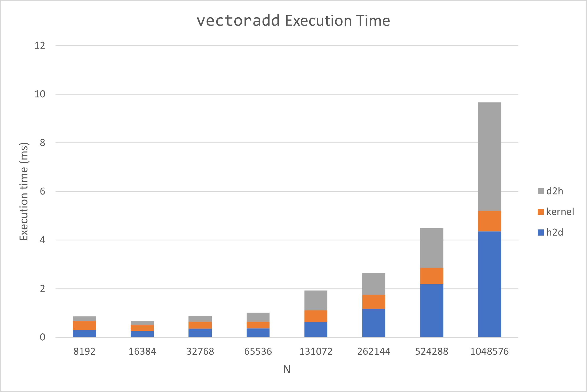
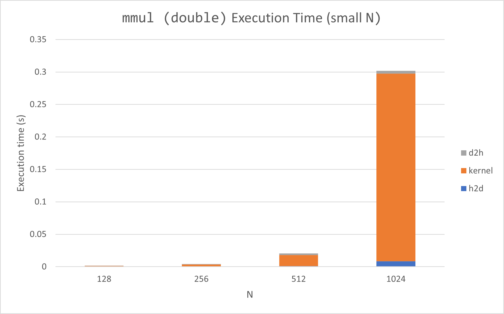
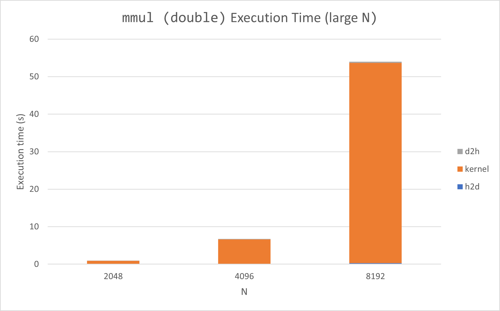
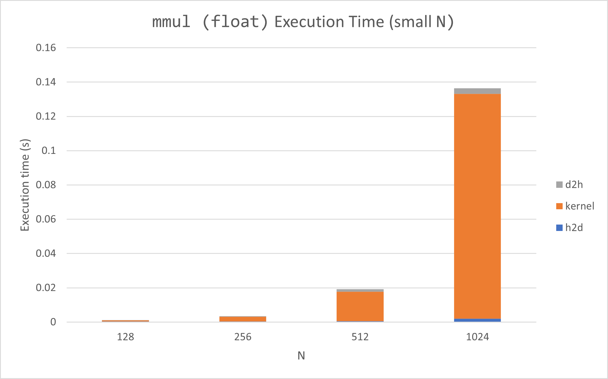
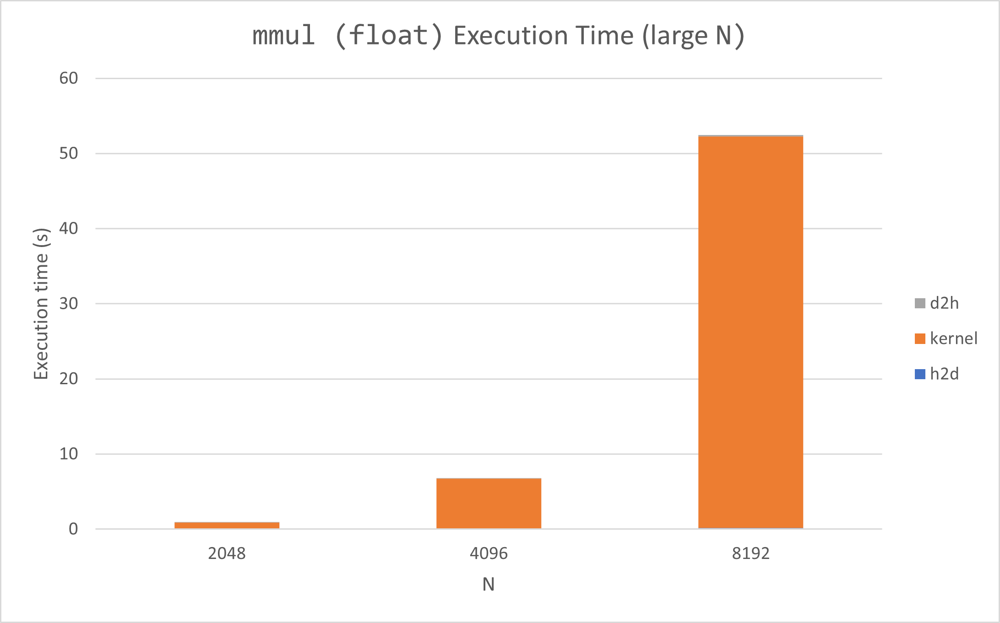

%Assignment II: CUDA Basics I
%Aritra Bhakat
%\today
---
documentclass: scrartcl
---

[GitHub repo](https://github.com/arrebarritra/DD2360HT23/tree/main/hw_2)

## Exercise 1: Your first CUDA program and GPU performance metrics
1. **Explain how the program is compiled and run.**

    The program is compiled with `nvcc -arch=sm_61 src_file -Xptxas -O3 -o dst_file`. The `-arch=sm_61` flag corresponds to my GTX 1070 GPU architecture. I also pass the flag `-Xptxas -O3` maximise the optimisation for the kernel code, and `-Xcompiler -O3` to do the same for the host code. This outputs and executable called `dst_file`, which can then be run on the command line with `./dst_file`.

2. **For a vector length of N:**

    1. **How many floating point operations are being performed in your vector add kernel?**

        There are $N$ floating point operations being performed by my add kernel, as there is one addition performed in each thread. If there are more than $N$ threads, the threads that do not correspond to a vector element do not do any additions.

    2. **How many global memory reads are being performed by your kernel?**

        There are $2N$ global memory reads performed by the kernel, as each thread has to read the 2 vector elements that need to be added.

3. **For a vector length of 1024:**

    1. **Explain how many CUDA threads and thread blocks you used.**

        I use a constant amount of threads per block, in this case `TPB = 32`. The amount of thread blocks is `1024 / 32 = 32`. This means the total amount of threads is `32 * 32 = 1024`

    2. **Profile your program with Nvidia Nsight. What Achieved Occupancy did you get?**

        `0.033144`

4. **Now increase the vector length to 131070:**
    
    1. **Did your program still work? If not, what changes did you make?**

        The program still works.

    2. **Explain how many CUDA threads and thread blocks you used.**

        The amount of threads per block is still `TPB = 32`. The amount of thread blocks is $\lceil N / TPB \rceil = \lceil 4095.94 \rceil = 4096$. Thus the amount of threads is `4096 * 32 = 131072`.

    3. **Profile your program with Nvidia Nsight. What Achieved Occupancy do you get now?**

        `0.403677`

5. **Further increase the vector length, plot a stacked bar chart showing the breakdown of time including (1) data copy from host to device (2) the CUDA kernel (3) data copy from device to host.**

    

    The execution time is dominated by the data transfer, especially for larger $N$. The kernel execution time is close to constant, or at least increases very slowly. This is probably because there are enough cores to execute the kernel at once for smaller data sizes.

## Exercise 2: 2D Dense Matrix Multiplication

1. **Name three applications/domains of matrix multiplication.**
    - Transform matrices in 3D graphics
    - Stress tensor in solid mechanics
    - Quantum gates which can be represented by matrices (applying multiple gates corresponds to matrix multiplication)

2. **How many floating point operations are being performed in your matrix multiply kernel?** 

    Each thread performs `numAColumns` multiply-adds (2 operations). There are `numARows * numBColumns` threads, so in total `2 * numARows * numBColumns * numAColumns = 2 * numARows * numBColumns * numBRows` floating point operations are performed by the kernel.

3. **How many global memory reads are being performed by your kernel?**
    
    For each multiply-add 3 global memory reads are performed. Then, in total `3 * numARows * numBColumns * numAColumns` global memory reads are performed.

4. **For a matrix A of (128x128) and B of (128x128):**

    1. **Explain how many CUDA threads and thread blocks you used.**

        The amount of threads per block dimension I kept constant, using `TPBD = 16`. The layout of the thread blocks is `(128, 128) / 16 = (8, 8)`, so a total of 64 thread blocks were used. The amount of threads is `64 * 16 * 16 = 16384`. 

    2. **Profile your program with Nvidia Nsight. What Achieved Occupancy did you get?**

        `0.532290` 

5. **For a matrix A of (511x1023) and B of (1023x4094):**

    1. **Did your program still work? If not, what changes did you make?**
        
        The program still works.

    2. **Explain how many CUDA threads and thread blocks you used.**

        The amount of threads per block dimension is still `TPBD = 16`. The amount of thread blocks in each dimension is calculated as $\lceil (511, 4094) / 16 \rceil = (32, 256)$. The total amount of thread blocks is then `32 * 256 = 8192`. The total amount of threads is `8192 * 16 * 16 = 2097152`.

    3. **Profile your program with Nvidia Nsight. What Achieved Occupancy do you get now?**

        `0.985776`

6. **Further increase the size of matrix A and B, plot a stacked bar chart showing the breakdown of time including (1) data copy from host to device (2) the CUDA kernel (3) data copy from device to host. For this, you will need to add simple CPU timers to your code regions. Explain what you observe.**

    For the following tests, we use square matrices of size $N$.

    

    

    For large $N$, the execution time is dominated by the kernel time, data transfer time is negligible in comparison. This is because complexity of matrix multiplication increases as $\mathcal{O}(n)$ per thread, and all threads not being able to execute simultaneously as they don't fit into register.

7. **Now, change DataType from double to float, re-plot the a stacked bar chart showing the time breakdown. Explain what you observe.**

    

    

    When using floats, kernel time remains similar despite the smaller size of the data. This is probably because we are still using the same amount of threads and they are scheduled the same way. If the data could be packed tighter execution time could probably be halved. Data transfer time is of course halved (looking at the raw data, not visible on the cahrt as data tranfer time << kernel time), as floats are half the size of doubles.