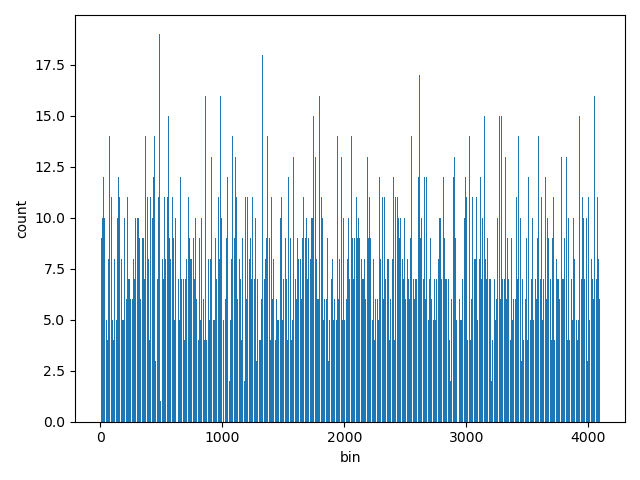
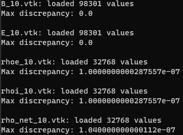

%Assignment III: CUDA Basics II
%Aritra Bhakat
%\today
---
documentclass: scrartcl
---

[GitHub repo](https://github.com/arrebarritra/DD2360HT23/tree/main/hw_3)

# Exercise 1: Histogram and Atomics

1. **Describe all optimizations you tried regardless of whether you committed to them or abandoned them and whether they improved or hurt performance.**

    The first optimisation I tried (after implementing a naive version that only accesses global memory), was to keep the bins in shared memory, so each block had its local version. Then, I performed a reduction between the blocks, adding the bins together atomically. I let each thread within a block be responsible for adding a region of the bins. This did not work unfortunately and increased the time initially. Using 1024 threads gave the best performance for the method, but the simple global memory method outperformed by around a factor of 2.

    To reduce contention in global memory I didn't perform the atomic add if a bin is empty. Even though it leads to branching it reduced the histogram kernel execution time.

2. **Which optimizations you chose in the end and why?**

3. **How many global memory reads are being performed by your kernel? Explain**

    - Each thread reads its corresponding input data element from global memory
      - `num_elements` reads
    - In each block all the bins in global memory updated
      - up to `num_bins * gridSize` reads (a check is performed to reduce unnecessary atomic operations to reduce contention)

4. **How many atomic operations are being performed by your kernel? Explain**

    Up to `num_bins * gridSize` atomic operations are performed by the kernel, as each block adds it's own local histogram to the global one. Atomic operations are avoided when bins are empty to reduce contention.

5. **How much shared memory is used in your code? Explain**

    Each block uses `sizeof(unsigned int) * NUM_BINS = 16.38 kB` of shared memory to store the shared histogram.

6. **How would the value distribution of the input array affect the contention among threads? For instance, what contentions would you expect if every element in the array has the same value?** 

    Having many of the same value in the input array will increase contention between threads, since they will need to wait for more threads performing atomic addition to the same bin in global memory. If every element in the array has the same value, the kernel would degenerate into serial code.

7. **Plot a histogram generated by your code and specify your input length, thread block and grid.**

    The histogram was plotted for an input length of $n=2^{15}$, using `1024` threads per block, and `(num_elements + TPB_HIST - 1) / TPB_HIST = 32` blocks.

    

8. **For a input array of 1024 elements, profile with Nvidia Nsight and report Shared Memory Configuration Size and Achieved Occupancy. Did Nvsight report any potential performance issues?**

    ```
    Shared Memory Configuration Size                                                 Kbyte                          32.77
    ...                                                                                ...                            ...
    Achieved Occupancy                                                                   %                          47.57
    ```

    No issues potential issues were reported by Nvsight.

# Exercise 2: A Particle Simulation Application

1. **Describe the environment you used, what changes you made to the Makefile, and how you ran the simulation.**

    I use a WSL2 Ubuntu environment within my Windows PC. I had to change the Makefile variable for the GPU architecture to `ARCH=sm_61` which corresponds to my GTX 1070 GPU architecture. I also created two variables in the Makefile, `DEVICE` and `DEBUG`, to make it easier to compile on either CPU or GPU and also in debug mode so I could use `cuda-gdb`. I could then run the executable with my chosen configuration.

2. **Describe your design of the GPU implementation of mover_PC() briefly.**
    
    I created a kernel for both `mover_PC` and `interP2G` for my port. Rather than doing all the allocation within the GPU versions before calling the kernel, I ported the allocation code for `particle`, `EMfield`, `grid`, `interpDensSpecies` and `parameters` to CUDA. That includes functions for performing synchronisation between the host and device.
    
    The `part` structure only needs to be synced once, at the start of the program. This is because the particles are never directly accessed by the host code. Instead, when we are in the `interP2G` kernel we access the `part` struct on the device, and use that to update the `ids` values. This does need to be synced back to the host, as there are some host side function like `applyBCids` accessing. It also modifies the data, so it needs to be synced to device at the start of every cycle. The, `field`, `grid` and `param` structs are all constant, so only need to be synced once at the start.

    For allocation, I needed to not only copy the structs, but perform a deep copy of all the data arrays that are pointed to in the flat arrays, and make sure the pointers on the device version of the struct point to the correct data.

    In order to retain the chained pointer functionality, I also ported the relevant parts of `Alloc.h` to CUDA. That involved allocating multiple levels of struct that hold pointers to pointers to pointers etc. And then correctly calculating the pointer offset.

    This allowed me to mostly leave the kernel code unchanged from the original host version of `mover_PC` and `interP2G`, as I didn't have to change any indexing. The main change was in the `interP2G` kernel where I had to use `atomicAdd` when accessing data in `ids`, to avoid race conditions from concurrent access.

3. **Compare the output of both CPU and GPU implementation to guarantee that your GPU implementations produce correct answers.**

    I used ParaView to visually compare the two implementations visually, and qualitatively there seemed to be no difference for both the `GEM_2D` and `GEM_3D` inputs.

    I also compared the output values between the versions, to find the maximum difference between the results from the CPU and GPU.

    

    We can see the difference is negligible, and comes down to floating point errors. There is no difference in the E and B file since they are constant and do not change from initialisation.

4. **Compare the execution time of your GPU implementation with its CPU version.**

    |     | GEM_2D | GEM_3D |
    |-----|--------|--------|
    | CPU |        |        |
    | GPU |        |        |