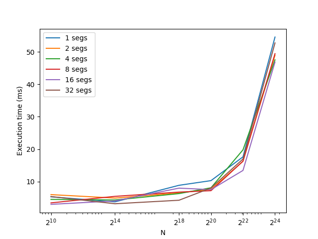
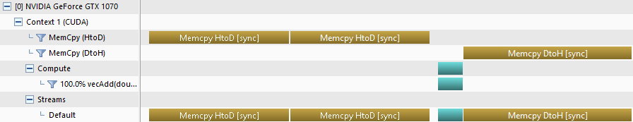
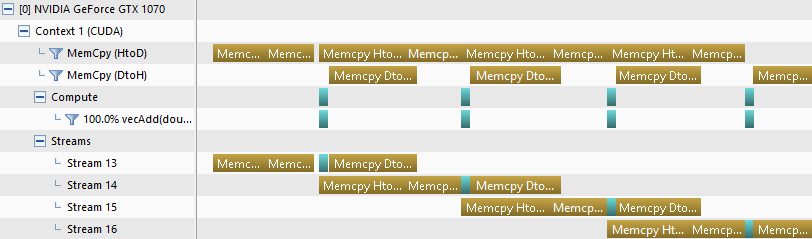
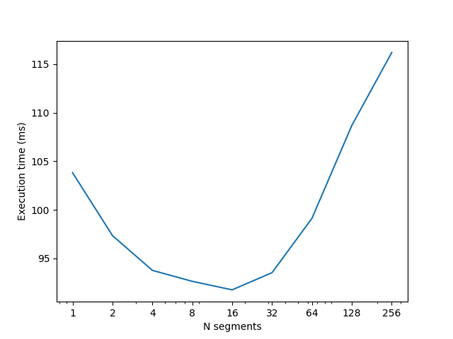
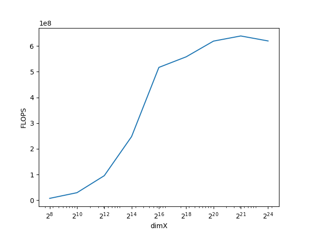
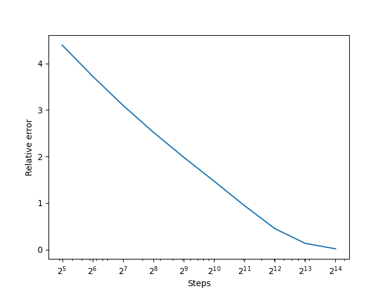
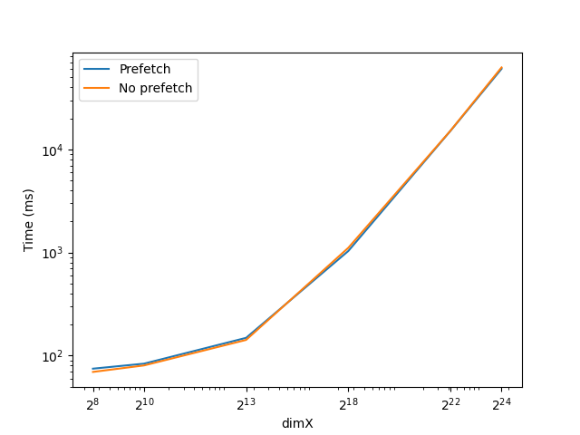

%Assignment IV: Advanced CUDA
%Aritra Bhakat
%\today
---
documentclass: scrartcl
---

[GitHub repo](https://github.com/arrebarritra/DD2360HT23/tree/main/hw_4)

# Exercise 1:  Thread Scheduling and Execution Efficiency 

1. **Assume X=800 and Y=600. Assume that we decided to use a grid of 16X16 blocks. That is, each block is organized as a 2D 16X16 array of threads. How many warps will be generated during the execution of the kernel? How many warps will have control divergence?**

    We have a grid size of $\lceil(800, 600)/(16, 16)\rceil = (50, 18)$, adding up to a total of $900$ blocks. Each block contains $\frac{16 \cdot 16}{32} = 8$ warps, giving us a total of $7200$ generated warps. The last row of blocks (corresponding to pixels `(0, 592) - (800, 608)`) will have divergence within the blocks since half the threads within the block are outside the image. However, since warps are assigned linearly, each warp corresponds to 2 rows (16 + 16 threads). Therefore the warps divide evenly between rows, and there is no control divergence.

2. **Now assume X=600 and Y=800 instead, how many warps will have control divergence?**

    In this case the last column of blocks will diverge, `(592, 0) - (607, 0)`. In each warp within this region, half the threads will be inside the image (`592-599`), and half outside (`600-607`). Since each warp corresponds to 2 rows, there are $800 / 2 = 400$ warps with control divergence.

3. **Now assume X=600 and Y=799, how many warps will have control divergence?**

    Similarly to the last scenario, the last column of blocks but now also the last row of blocks will have divergence within the block. However, only the last warp of the last row of blocks will have control divergence, since only the last row (pixels `(0, 799) - (599, 799)`) is outside the image. These add up to $\lceil 600 / 16 \rceil = 38$ warps. Since the bottom right corner is double counted, the total number of warps with control divergence is $400 + 38 - 1 = 437$.

# Exercise 2: CUDA Streams

1. **Compared to the non-streamed vector addition, what performance gain do you get?**

    The execution time for non-streamed vs streamed vector addition (many different segement size/amount tested as well) for different vector sizes can be seen in the plot below:

    

    There is a slight performance gain achieved using streamed vector addition in comparison to non streamed (ie. 1 segment). The streamed versions with around 8-16 segments perform the best. For the largest problem size, $2^{24}$, a 1.16x speedup is achieved for the fastest streamed addition (16 segments).

2. **Use nvprof to collect traces and the NVIDIA Visual Profiler (nvvp) to visualize the overlap of communication and computation.**

    We can see that there is no overlap in communication for the non-streamed version:

    

    The copy engine stays idle most of the time. But for the streamed version there is overlap in communication and computation (using 4 segments in this case):

    

    Both directions of the copy engine is occupied most of the time. The vector addition kernels are very simple though, which means the compute engine stays idle most of the time.

3. **What is the impact of segment size on performance?**

    Too small segment size doesn't improve performance, probably due to the overhead of creating multiple streams. Too large streams can make performance revert to similar levels as the non-streamed version, as the overlap of communication and computation isn't taken advantage of. We can see exactly this in the following plot, where the execution time depending on the amount of segments is measured for the problem size $N=2^{25}$ using the mean of 3 runs:

    

    For this $N$, 16 segments seems to be optimal, with a 1.13x speedup. If there are too many segments ($>\sim 80$) performance is worse than non-streamed vector addition.

# Exercise 3: Heat Equation with using NVIDIA libraries

1. **Run the program with different dimX values. For each one, approximate the FLOPS (floating-point operation per second) achieved in computing the SMPV (sparse matrix multiplication).**

    For the matrix multiplication, each row with non-zero values (`dimX-2` of them in fact) in the matrix $A$, cuSPARSE will perform 5 floating-point operations (FLOs): 3 multiplications and 2 additions. Then, in the vector addition part, cuBLAS performs `dimX` multiplications and `dimX` additions of the dense vectors `tmp` and `temp`. Finally, when the norm is calculated, `dimX` multiplications and `dimX-1` additions are performed to get the norm squared. A square root is performed, and we take this as 1 operation. This might be inacurrate, but is also negligible since only 1 is performed. This is performed in every timestep, so in total `[5 * (dimX-2) + 2 * dimX + 2 * dimX] * timesteps` FLOs are performed (around `9 * dimX * timesteps` more approximately).
    
    Using this approximation we can measure the execution time of the relaxation to approximate the FLOPS achieved. We vary `dimX` from $2^{8}$ to $2^{24}$, and keep the amount of timesteps constant at $2^{8}$ for the measurement (if it is set equal to `dimX` for instance execution time would be increasing as the square of `dimX` which could be misleading).

    

    For small `dimX` peak throughput isn't reached as all the warps are not occupied. At large `dimX` we reach a peak throughput 619 MFLOPS.

2. **Run the program with dimX=128 and vary nsteps from 100 to 10000. What do you observe?**

    The relative error should decrease as we increase `nsteps`. We see this is the case in the following plot:

    

    The error decreases exponentially as it is linear in the logX plot.

3. **Compare the performance with and without the prefetching in Unified Memory. How is the performance impact?**

    Similarly to when the FLOPs were calculated, we keep the number of steps at a constant $2^8$, and compare the performance for large `dimX`, as that is where memory prefetching is likely to have the most impact. We get the following plot:

    

    The difference in performance is negligible; marginally better performance with no prefetching for small `dimX` and marginally better performance with prefetching for large `dimX`. Prefetching is only done at the start of the application when the arrays are created. No syncing needs to be done during relaxation as all the necessary data is already on the GPU. That's why memory prefetching is not very useful in this particular application. If the cuBLAS/cuSPARSE methods only had to be run once, or data needed to be synced after every few calls, prefetching would improve performance.

    Unfortunately, unified memory profiling does not seem to be supported on Pascal on Windows, so I could not look deeper into the issue.